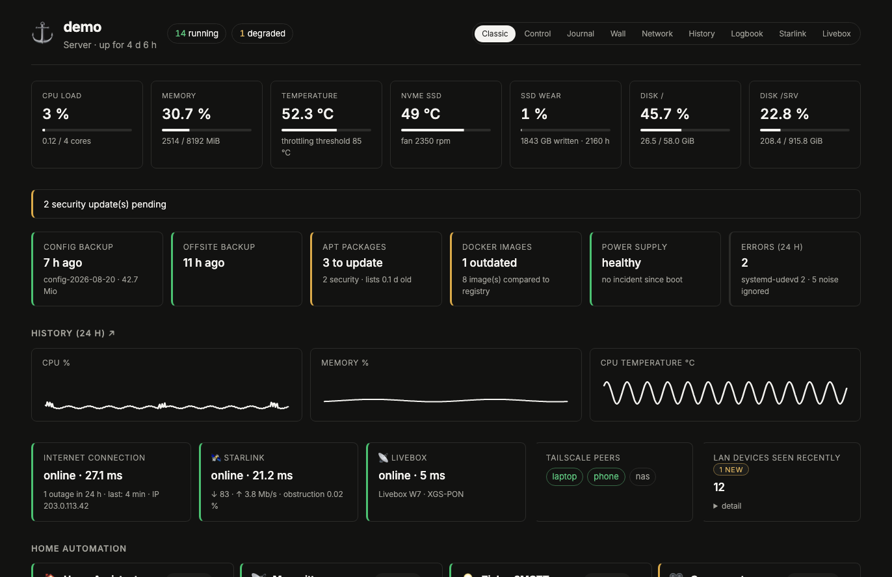
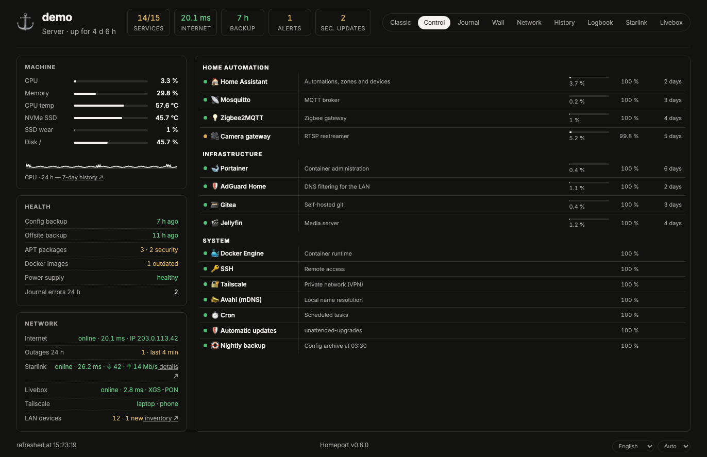
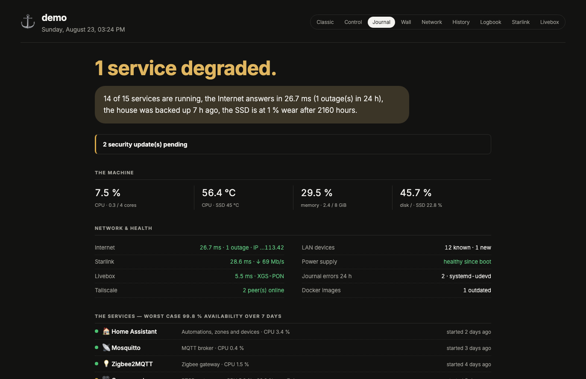
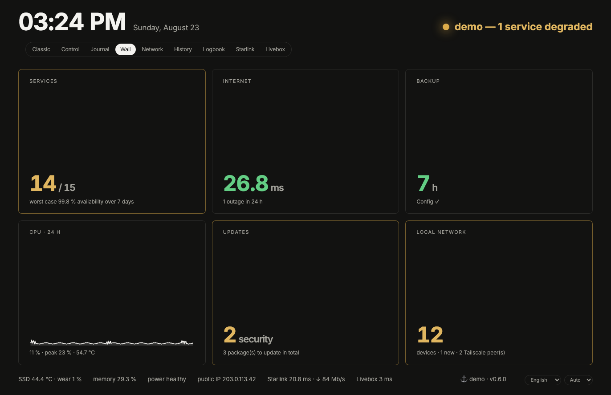

# ⚓ Homeport

**A home server dashboard that reads what your machine already knows — and presents it well.**

Homeport supervises the services of a self-hosted home server (Home Assistant, Mosquitto,
Portainer, any Docker container or systemd unit), the machine's health (CPU, memory,
temperatures, SSD wear, power), the local network (device inventory with names, Tailscale,
Internet health), and lets an authenticated admin restart services or wake machines — all
from a single, fast, dependency-free web page.

It sits deliberately between "too simple" (a probe list) and "too heavy" (a metrics stack):
no agents, no external database, no JavaScript framework. One Python service, one SQLite
file, one YAML config.

## Four views, one truth

| | |
|---|---|
| **Classic** — server-rendered cards with drill-down details, logs, restart buttons |  |
| **Control** — dense two-column command center: pills, machine bars, service table |  |
| **Journal** — a verdict ("All is well."), a narrative, and only what needs attention |  |
| **Wall** — giant numbers readable from across the room, made for a wall tablet |  |

## Try it in 30 seconds (demo mode)

```bash
git clone https://github.com/vincentlauriat/homeport && cd homeport
python3 -m venv venv && venv/bin/pip install -r requirements.txt
HOMEPORT_DEMO=1 venv/bin/uvicorn homeport.main:app --port 8080
# open http://localhost:8080 — a full dashboard on simulated data, no system access
```

## Install for real (Debian/Ubuntu, systemd)

```bash
git clone https://github.com/vincentlauriat/homeport && cd homeport
sudo ./deploy/install.sh
# then edit /etc/homeport/services.yaml and refresh the page — no restart needed
```

See [docs/getting-started.md](docs/getting-started.md). Optional integrations, each with its
own documented step: read-only Docker access ([socket proxy](deploy/socket-proxy/)),
restart actions ([exact-command sudoers](deploy/sudoers.example)), NVMe wear
([root timer](deploy/nvme/)), MQTT / Home Assistant discovery.

## What it watches

- **Services** — each combines up to three sources of truth (Docker state, systemd state,
  a TCP/HTTP probe Homeport performs itself). When they disagree — a container that runs
  but no longer answers — the service shows as *degraded*, exactly what `docker ps` hides.
- **Machine** — CPU, memory, temperatures, fan, disk usage, SSD wear (NVMe SMART),
  under-voltage and throttling on Raspberry Pi, journal errors, pending APT updates,
  outdated Docker images, local backup freshness.
- **Network** — LAN device inventory with the best available name (your label → mDNS →
  vendor from the MAC prefix), new-device detection, Tailscale peers, Internet latency and
  outage history, public IP changes.
- **History** — 7 days of CPU/memory/temperature charts with Internet outages overlaid
  as red bands, plus per-service availability percentages.
- **Logbook** — a one-year, day-grouped timeline of the events that matter: services
  falling and recovering, Internet outages, new devices, admin actions, boots and
  power incidents — with container logs one click away.

Everything degrades gracefully: no Docker → systemd and probes only; no Tailscale → a
read-only dashboard; not a Raspberry Pi → the Pi-specific tiles simply disappear.

## Security model (short version)

From the LAN, everything is **read-only** except editing a device's own metadata (name, note,
category). Every state-changing action (restart, Wake-on-LAN) requires both: the request
arrives over Tailscale **and** `tailscale whois` maps it to the single admin identity declared
in the config — and it must originate from a Homeport page (same-origin check, anti-CSRF).
Restarts go through exact-command sudo rules — never through the Docker socket, which Homeport
only ever reaches read-only via a socket proxy. Responses carry `X-Frame-Options: DENY` and a
restrictive Content-Security-Policy. Homeport makes **one** required outbound call (public IP
via api.ipify.org, disableable); Docker image-update checks additionally reach the relevant
container registries. No telemetry. Details: [docs/security-model.md](docs/security-model.md).

## Languages

English and French — pick per browser from the footer selector, or set the server default
with `language: fr` in the config. The footer also offers a light / dark / auto theme
choice per browser. Contributions of other languages are one JSON file away
([homeport/i18n/](homeport/i18n/)); note that the embedded fonts cover Latin only, so a
script outside that range needs its own font subset.

## License

MIT.
